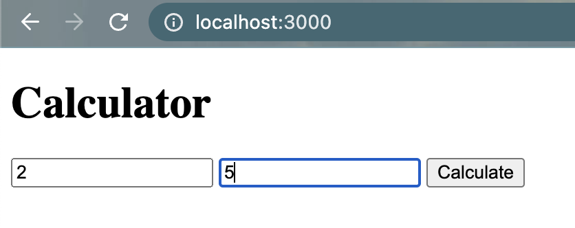

calculator

This is a simple website with a backend server using express.js with node.js. This also uses body-parser on the server which gives us access to properties and variables to be used. The JavaScript code is served from the backend server.

While the server is running locally you can access the website using http://localhost:3000/ in web browser.

A normal addition or sum calclulator can be found at the url: http://localhost:3000/

A BMI(Body Mass Index) calculator can be found at the url: http://localhost:3000/bmiCalculator

---

Screenshots

